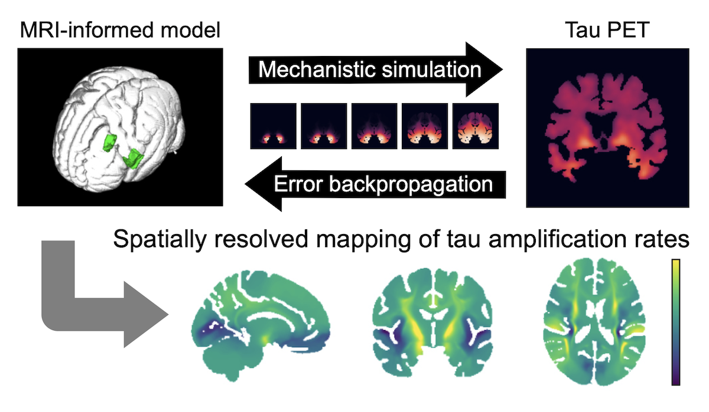

# Differentiable Tau Propagation

A JAX-based differentiable reaction–diffusion framework for spatially resolved mapping of tau amplification rates from PET data.
This repository accompanies the manuscript/preprint:

**Spatially resolved mapping of tau amplification rates via differentiable simulation of prion-like propagation**



---

## Overview

The repository includes the core methodological components of the paper:

* Differentiable reaction–diffusion simulation of prion-like propagation
* MRI-informed model parametrization
* GPU-accelerated implementation using JAX
* End-to-end differentiability for gradient-based optimization

---

## What is included

* `simndd/`
  contains the core implementation for setting up MRI-informed reaction–diffusion models, running numerical simulations, and optimizing model parameters by backpropagating errors through the differentiable simulator.

* `forward_simulation.ipynb`
  A minimal demonstration of:

  * Processing of neuroimages for model parametrization
  * Forward simulation of tau propagation
  * Visualization of spatiotemporal dynamics

---

## Installation

We recommend installing the package in a fresh virtual environment. The code has been tested with Python 3.10, JAX 0.4.26, and Equinox 0.11.4.

### Using pip

If you already have a Python environment activated, clone the repository and install the package as follows:

```bash
git clone https://github.com/kondo-y/differentiable-tau-propagation.git
cd differentiable-tau-propagation

pip install "numpy<2" "jax==0.4.26" "jaxlib==0.4.26" "equinox==0.11.4"
pip install -e ".[notebooks]"
```

If you need a different JAX build for your environment (e.g. hardware, operating system, and CUDA version), install JAX first following the official JAX instructions, then install this package.

---

## Data and code availability

This repository provides the core computational components of the differentiable tau propagation framework, including differentiable reaction–diffusion simulation and example workflows for running the model.

The original study used processed tau PET data from the Alzheimer's Disease Neuroimaging Initiative (ADNI). These imaging data are subject to ADNI data use agreements and are not redistributed in this repository.

Accordingly, this repository does not include ADNI-specific data processing scripts or subject-level batch analysis files that depend directly on restricted imaging data. To reproduce the full ADNI analysis, users should apply for access through ADNI and follow the preprocessing and analysis procedures described in the paper.

The code in this repository is intended to make the computational framework transparent and reusable independently of the restricted ADNI dataset.

---

## Citation

If you use this code, please cite our preprint:

Kondo, Y., Honda, N., for the Alzheimer's Disease Neuroimaging Initiative.  
Spatially resolved mapping of tau amplification rates via differentiable simulation of prion-like propagation.  
bioRxiv, 2026.  
https://www.biorxiv.org/content/10.64898/2026.06.02.729568v1

```bibtex
@article{kondo2026differentiabletau,
  title = {Spatially resolved mapping of tau amplification rates via differentiable simulation of prion-like propagation},
  author = {Kondo, Yohei and Honda, Naoki and {{for the Alzheimer's Disease Neuroimaging Initiative}}},
  journal = {bioRxiv},
  year = {2026},
  doi = {10.64898/2026.06.02.729568},
  url = {https://www.biorxiv.org/content/10.64898/2026.06.02.729568v1}
}
```
---

## Acknowledgements

This work builds on publicly available neuroimaging tools and datasets, including FSL, FreeSurfer, the Human Connectome Project, the Allen Human Brain Atlas, and the Alzheimer's Disease Neuroimaging Initiative (ADNI).
